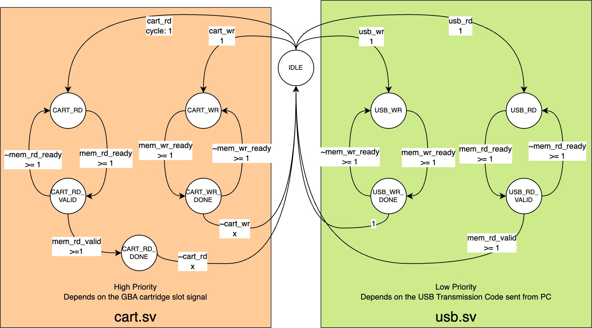

# GBA I/O

Turning the Gameboy Advance into a USB 3.1 peripheral I/O device, allowing us to use it freely for anything we'd like.

For example, it can be used as a display monitor while simultaneously as a keyboard/mouse controller and a speaker, allowing us to play computer games on it!

## Contents

| Folder | Description |
|-|-|
| gba-io-cart-slot-connector | A fairly simple edge connector PCB design between a custom-made third-party Xilinx Artix 7 FPGA development board and the cartridge slot of the GBA console. |
| gba-io-fpga | The Verilog circuit design for the Xilinx Artix 7 FPGA. It works in between the GBA console (through the cart slot edge connector), the DDR3 SDRAM, and the CYUSB3014 USB 3.1 Peripheral Controller. |
| gba-io-rom | The GBA ROM that is going to be deployed into the FPGA SDRAM and executed by the GBA console. It can actively read video/sound feed from the cartridge ROM, and write keypad input feed to the cartridge SRAM. (both are located in the SDRAM of the FPGA development board) |
| gba-io-app | A Windows application that interacts with the FPGA device through the USB driver. It opens up the web-socket server locally, allowing other programs to access the inputs and outputs of the GBA console. It also supports sending the PC's display and system sound outputs to the GBA LCD and audio outputs and receiving the GBA keypad input as the PC's keyboard or mouse input. The CYUSB driver is required, ideally, it will be automatically installed by Windows. |

### Prior to Build

#### gba-io-cart-slot-connector & gba-io-fpga

I'm using the JLCPCB for the edge connector, and Vivado for the FPGA design.

Since many FPGA boards are floating around, and since I'm using a not-so-common one, you might need to customize the gba-io-cart-slot-connector based on the port definition of your own FPGA board to suit your need, the same goes with the gba-io-fpga project too, you may need to update the Constraints file or the DDR3 Memory Interface based on your own board's spec. Anyway, here's the spec of what I've been using:

1. FPGA: XC7A100T-2FGG484I Xilinx Artix-7
2. SDRAM: MT41J256M16TW-107 1.35v DDR3L IT:P 256x16bit
3. USB Controller: CYUSB3014-BZXI EZ-USB™ FX3 USB 5 Gbps Peripheral Controller
4. Configuration Flash: IS25LP128 128Mb 3V SERIAL FLASH MEMORY WITH 133MHZ MULTI I/O SPI & QUAD I/O QPI DTR INTERFACE

#### gba-io-rom

Install DevKitPro and make sure the `DEVKITARM` environmental variable is set.

Run the `make` command under the gba-io-rom folder, it should generate the `gba-io-rom/target/gba-io-rom.gba` ROM file that is dependent upon the gba-io-app project.

#### gba-io-app

Install Visual Studio 2022(v143) with Windows SDK v10.0.

Download and install the CYUSB SDK from [Infineon's official website](https://www.infineon.com/cms/en/design-support/tools/sdk/usb-controllers-sdk/ez-usb-fx3-software-development-kit/), it should contain the CyAPI.h and CyAPI.lib dependencies.

Project Property → C/C++ → Additional Include Directories → [ Update your CyAPI.h file location ]

Project Property → Linker → Input → Additional Dependencies → [ Update your CyAPI.lib file location ]

Then build the solution and run.

## Specifications

| I/O Direction | Usage | Size (Bytes) | GBA CPU Address (gba-io-rom) | GBA Cartridge Bus Address | FPGA SDRAM Address (gba-io-fpga) |
|-|-|-|-|-|-|
| PC → GBA | Compiled gba-io-rom | 0x1000000 | 0x08000000 | CS1 0x00000000 | CODE 0x00000000 |
| PC → GBA | Video Feed | 0xE00000 | 0x09000000 | CS1 0x01000000 | V_Buffer 0x01000000 |
| PC → GBA | Sound L Feed | 0x100000 | 0x09E00000 | CS1 0x01E00000 | SL_Buffer 0x01E00000 |
| PC → GBA | Sound R Feed | 0x100000 | 0x09F00000 | CS1 0x01F00000 | SR_Buffer 0x01F00000 |
| GBA → PC | Key Feed & Status Registers | 0x20 | 0x0E000000 | CS2 0 | KEY_AND_STATUS 0x02000000 |

And here's the corresponding address encoding:

```text
  24        20        16        12        8         4         0
0 0 │ 0 0 0 0 │ 0 0 0 0 │ 0 0 0 0 │ 0 0 0 0 │ 0 0 0 0 │ 0 0 0 0
│ │   │ │ │ │     │ │ │                           │ │         │
│ │   │ │ │ │     │ │ │                           │ │         └── 16-bit alignment shift fixed zero
│ │   │ │ │ │     │ │ │                           │ │
│ │   │ │ │ │     │ │ │                           └─┴──────────── 00: SOUND_X_FEED_FRAME_0, 01: SOUND_X_FEED_FRAME_1, 10: SOUND_X_FEED_FRAME_2
│ │   │ │ │ │     │ │ │
│ │   │ │ │ │     └─┴─┴────────────────────────────────────────── 000: VIDEO_FEED_FRAME_0, 010: VIDEO_FEED_FRAME_1, 100: VIDEO_FEED_FRAME_2
│ │   │ │ │ │
│ │   └─┴─┴─┴──────────────────────────────────────────────────── 1110: SOUND_L_FEED, 1111: SOUND_R_FEED, rest: VIDEO_FEED
│ │
│ └────────────────────────────────────────────────────────────── 0: CODE, 1: XXXX_FEED
│
└──────────────────────────────────────────────────────────────── 0: ^CS1 == 1, 1: ^CS2 == 1 (for SDRAM)
```

There are two types of addresses in general, and we treat them differently, one is the shared memory for both the GBA console and PC, including the cartridge ROM data, the key feed, and some status registers, another one is the buffers, including the video feed and the double channel sound feeds. The selection is driven by the GBA console from both the current GBA cartridge bus address and the cartridge bus's RD/WR signal. You can get the details in the following sections.

The SDRAM is shared between the GBA console and the USB FIFO, instead of using a memory controller, the accessing to it is multiplexed.

### Shared SDRAM Memory Multiplexer

This part is dedicated to any of the memory segments.


Since the GBA console's cartridge accessing is very time-critical, we cannot afford to use a FIFO pipeline to streamline the SDRAM memory accessing, instead, we implement a state machine to minimize cycle delay.

#### Reading from the SDRAM

| Priority | I/O Direction | | |
|-|-|-|-|
| 1st | PC → GBA | GBA Cartridge Bus ← Holding Register ← | | |
| 2nd | GBA → PC | USB Port ← CYUSB3014 GPIF ← AXI Stream FIFO ← | | |
| | | | ← Multiplexer ← Buffer Address Translation ← SDRAM |

When the GBA console starts to read from the SDRAM, the FPGA will immediately fetch the data from the SDRAM and store it in the Holding Register, which is directly connected to the cartridge bus, and feeds the GBA. The USB FIFO will be put on hold during the GBA console ↔ SDRAM transaction.

#### Writing to the SDRAM

| Priority | I/O Direction | | |
|-|-|-|-|
| 1st | GBA → PC | GBA Cartridge Bus → Address Validation Logic → | |
| 2nd | PC → GBA | USB Port → CYUSB3014 GPIF → AXI Stream FIFO → | |
| | | | → Multiplexer → Buffer Address Translation → SDRAM |

When the GBA console starts to write to the SDRAM, the FPGA will first check if the address range is within the available SRAM address range, then send the data to the SDRAM directly. The USB FIFO will be put on hold during the GBA console ↔ SDRAM transaction.

#### The Pain of Memory Stalling

Well, I have to admit, I'm not a professional in hardware development, and I only discovered this halfway building the project, yes, the DDR3 SDRAM may stall for a pretty long time to refresh the memory content, according to the info from the datasheet of the chip I've been using (MT41K256M16TW-107), the 4Gbit DDR3 tRFC is 260ns ~ 70200ns, which is about 4.3 ~ 1170 GBA cycles (60ns/cycle for the 16.78MHz GBA clock).

TODO
To mitigate this problem, 

### SDRAM Triple Frame Buffering, Cross Frequency Synchronization with Semaphores and Frames

This part is dedicated only to the buffers including V_Buffer, SL_Buffer, and the SR_Buffer.

| Name | Frame Size (Bytes) | Frame Count | Buffer Size (Bytes) | Repeats on Cartridge Bus Address |
|-|-|-|-|-|
| V_Buffer 0x01000000 | 0x20000 | 3 | 0x60000 | 0xE00000 / 0x20000 = 0x70 = 112 |
| SL_Buffer 0x01E00000 | 0x10 | 3 | 0x30 | 0x100000 / 0x10 = 0x10000 |
| SR_Buffer 0x01F00000 | 0x10 | 3 | 0x30 | 0x100000 / 0x10 = 0x10000 |

The GBA console will always only consume one single frame at a time from the triple frame buffer, since the GBA cartridge bus address space is a lot larger, this single frame will be presented repeatedly in a mirrored style.

Since the GBA console and the PC are accessing the buffer across different clock frequencies (and domains of course), the binary [Semaphore](https://en.wikipedia.org/wiki/Semaphore_(programming))s are utilized for each frame of the triple frame buffer. In short, each frame can be marked as `OCCUPIER_CART`, `OCCUPIER_USB`, or `OCCUPIER_NONE`, at each time when the GBA console or the PC tries to access the buffer, the FPGA logic will choose the appropriate frame according to its semaphore status, and update it with the new one.

### USB 3.1 Implementation

We emphasize both the default CYUSB driver for the PC and the default 2-bit address synchronized slave FIFO firmware for the CYUSB3014 microcontroller from the FX3 SDK.

| FPGA FIFO Component | GPIF2 Slave FIFO Address | EndPoint Address / Pipe / Socket | Direction | Transfer Type / Attributes | Maximum Packet Size (Bytes) | Usage |
|-|-|-|-|-|-|-|
| fifo_data_tx (m_axis) | 0b00 | 0x02 | 0x0X = OUT | Bulk 2 | 0x2000 = 8192 | PC → GBA data transmission, i.e., CODE, V_Buffer, SL_Buffer, and SR_Buffer |
| fifo_data_rx (s_axis) | 0b01 | 0x86 | 0x8X = IN | Bulk 2 | 0x2000 = 8192 | GBA → PC data transmission, i.e., KEY_AND_STATUS |
| fifo_ctrl_tx (m_axis) | 0b10 | 0x04 | 0x0X = OUT | Bulk 2 | 0x2000 = 8192 | PC → FPGA code transmission |
| fifo_ctrl_rx (s_axis) | 0b11 | 0x88 | 0x8X = IN | Bulk 2 | 0x2000 = 8192 | FPGA → FPGA repeating 0x47424120492F4F0A (`GBA I/O\n` in Hex) for device identification |

The address offset is automatically incremented, and it will reset to 0 when any of the Transmission Code is sent to the fifo_ctrl_tx.

Here's the encoding of the Transmission Code:

```text
64          32           0
00 │ 0000 0000 │ 0000 0000
││   ││││ ││││   ││││ ││││
││   ││││ ││││   └┴┴┴─┴┴┴┴── 32-bit transmission data size, 32-bit alignment required
││   ││││ ││││
││   └┴┴┴─┴┴┴┴────────────── 32-bit transmission address
││
└┴────────────────────────── 0x00: DISABLE, 0x40: Enable fifo_data_rx IN, 0x80: Enable fifo_data_tx OUT
```

| FPGA SDRAM Address (gba-io-fpga) | Packet Count for a Complete Transmission |
|-|-|
| None | N/A |
| CODE 0x00000000 | 0x1000000 / 0x2000 = 0x800 = 2048 |
| V_Buffer 0x01000000 | 0x20000 / 0x2000 = 0x10 = 16 |
| SL_Buffer 0x01E00000 | 0x10 / 0x10 = 1 |
| SR_Buffer 0x01F00000 | 0x10 / 0x10 = 1 |
| KEY_AND_STATUS 0x02000000 | 0x20 / 0x20 = 1 |

### Handling CDC (Clock Domain Crossing) between the GBA Console and the FPGA

[Crossing Clock Domains in an FPGA](https://nandland.com/lesson-14-crossing-clock-domains/)

[Edge detecting on a slow external clock](https://adaptivesupport.amd.com/s/question/0D52E00006iHtI7SAK/edge-detecting-on-a-slow-external-clock?language=en_US)

From the FPGA's side of view, the wires coming from the GBA console are all in a metastable state, we want to handle and conceal this uncertainty in a single place, which is the `gba-io-fpga\cart.sv`, so that the metastability won't spread to everywhere and creating nightmares.

Here are the pinouts of the GBA Cartridge Bus:

| Power | Clock | Signal | Address / Data |
|-|-|-|-|
| Vdd(3V3), GND | PHI(16.78MHz) | ^WR, ^RD, ^CS1, ^CS2, IRQ\DREQ | AD[0:15], A[16:23]* |
| 2 | 1 | 5 | 24 |

<sub>_*The lowest address bit is not presented in the address line of the GBA Cartridge Bus, it will always be zero, which creates a 16-bit data alignment, hence the 32 MB address space._</sub>

For the GBA → FPGA inputs, each one of the wires shall go into a flip-flop synchronizer first, 2 stages for each of the address/data lines, and 3 stages for each of the signal lines (an extra one for checking the edges).

For the FPGA → GBA outputs, instead of stretching out the cycles, the value will be indefinitely stored in a holding register, until it has been refreshed.

## Calculations

### Maximum Load of the Cartridge Bus

Assuming the Prefetch Buffer on the GBA console requested cartridge ROM data at each of every phase, that will be either 24 bits of address or 16 bits of data (AD[0:15], A[16:23]), auto address incrementing is utilized, so a continuous address access will omit the following addresses, plus 5 control bits (^WR, ^RD, ^CS1, ^CS2, IRQ\DREQ), in total average, about 3bytes/cycle data load on cartridge slot. The clock rate is around 16.78MHz, thus the maximum data load on the cartridge slot is around 16.78 * 3 = 50.34 MB/s. To make our device support an almost-real-time communication in the most simplistic estimation (not considering buffers, etc.) for the maximum load, the real-world maximum speed of the USB 2.0 is not fast enough with a speed of around 43 MB/s ([Source](https://superuser.com/questions/317217/whats-the-maximum-typical-speed-possible-with-a-usb2-0-drive)).

### Byte Rate Baseline

| Case | Calculation | Total |
|-|-|-|
| Data Per Frame | 0x400 Bytes PALETTE RAM + 0x18000 Bytes VRAM = 0x18400 Bytes = 99328 Bytes = 97 * 1024 Bytes | = 97 KBytes |
| Cycle Per Frame | (1004 cycles HDRAW + 228 cycles HBLANK) * (160 VDRAW scanlines + 68 VBLANK scanlines) | = 280896 cycles |
| Refresh Rate | 0x1000000 cycles/sec / 280896 cycles | ~ 59.72750056960583Hz |
| Video Byte Rate | Refresh Rate * Data Per Frame ~= 5932613.176577808 Bytes/sec | ~ 5.657781 MBytes/sec |
| Audio Byte Rate | 65536Hz sampling rate * 2 channels * 1 Byte amplitude = 131072 Bytes/sec = 128 * 1024 Bytes/sec | = 128 KBytes/sec |
| Key Byte Rate | Refresh Rate * 5 Bytes | ~ 298.63750284802916 Bytes/sec |
| Total Minimum Required | ~6063983.8141 Bytes/sec | ~ 5.783 MBytes/sec |
| Maximum Continuous ROM Read Speed | 0x1000000 cycles/sec * 2 Bytes/cycle = 33554432 Bytes/sec | = 32 MBytes/sec |
| Maximum Continuous SRAM Read & Write Speed | 0x1000000 cycles/sec * 1 Byte/cycle = 16777216 Bytes/sec | = 16 MBytes/sec |

### Impedance of the GBA Cartridge Bus

I just couldn't find this piece of info all around the Internet, so I measured it myself.

TODO

## Thanks

The [GBA_CartConnector.step](https://www.printables.com/model/441016-gameboy-cartconnector/files) by @Icesythe7_256778

The [gba_cart_top.stl, gba_cart_bottom.stl](https://www.printables.com/model/190861-gameboy-advance-cartridge-gba-cart) by @Dave

```text

## Some References

Achieve Clock Domain Crossings by using Async FIFO
<https://zipcpu.com/blog/2018/07/06/afifo.html>
<https://zipcpu.com/blog/2017/10/20/cdc.html>
<https://docs.amd.com/r/en-US/ug903-vivado-using-constraints/Asynchronous-Clock-Domain-Crossings>

IEEE System Verilog
<https://iccircle.com/static/upload/img20240319175450.pdf>
<https://www.chipverify.com/systemverilog/systemverilog-datatypes>

https://sites.google.com/site/tedrossin/home/electronics/xilinxamd-fpga


#######

CYUSB SDK
https://softwaretools.infineon.com/tools/com.ifx.tb.tool.ezusbfx3sdk
https://github.com/YosysHQ/oss-cad-suite-build

```
